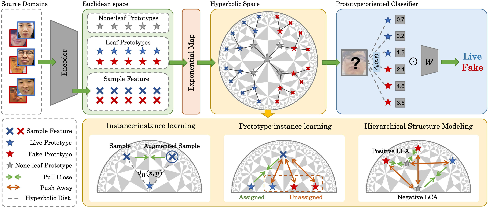

<h3 align="center">Rethinking Generalizable Face Anti-spoofing via Hierarchical Prototype-guided Distribution Refinement in Hyperbolic Space</h3>

  <p align="center">
    Chengyang Hu*, Ke-Yue Zhang*, Taiping Yao, Shouhong Ding, Lizhuang Ma
    <br />
    <a><strong>(CVPR 2024 Highlight)</strong></a>
    <br />
    <br />
    <a href="https://ojs.aaai.org/index.php/AAAI/article/view/27992">Paper</a>
    ·
    <a href="https://github.com/github_username/repo_name/issues/new?labels=bug&template=bug-report---.md">Code</a>
    ·
    <a href="https://github.com/github_username/repo_name/issues/new?labels=enhancement&template=feature-request---.md">Project Page</a>
  </p>
</div>


<!-- ABOUT THE PROJECT -->
## 💡 About The Project

This is the PyTorch implementation of our paper:

Rethinking Generalizable Face Anti-spoofing via Hierarchical Prototype-guided Distribution Refinement in Hyperbolic Space

Chengyang Hu*, Ke-Yue Zhang*, Taiping Yao, Shouhong Ding, Lizhuang Ma.

Conference on Computer Vision and Pattern Recognition 2024 (CVPR-24)



### Abstract

Generalizable face anti-spoofing (FAS) approaches have drawn growing attention due to their robustness for diverse presentation attacks in unseen scenarios. Most previous methods always utilize domain generalization (DG) frameworks via directly aligning diverse source samples into a common feature space. However, these methods neglect the hierarchical relations in FAS samples which may hinder the generalization ability by direct alignment. To address these issues, we propose a novel Hierarchical Prototype-guided Distribution Refinement (HPDR) framework to learn embedding in hyperbolic space, which facilitates the hierarchical relation construction. We also collaborate with prototype learning for hierarchical distribution refinement in hyperbolic space. In detail, we propose the Hierarchical Prototype Learning to simultaneously guide domain alignment and improve the discriminative ability via constraining the multi-level relations between prototypes and instances in hyperbolic space.
Moreover, we design a Prototype-oriented Classifier, which further considers relations between the sample and prototypes to improve the robustness of the final decision. Extensive experiments and visualizations demonstrate the effectiveness of our method against previous competitors.


<!-- GETTING STARTED -->

## 🔧 Installation

We highly recommoned to build our project with `Python >= 3.9` and `Pytorch >= 1.7`.

* We recommend you to use Anaconda to create a conda environment:
  ```shell
  conda create -n HPDR python=3.9
  conda activate HPDR
  ```
* Install the required packages:
  ```shell
  pip install -r requirements.txt
  ```


<!-- USAGE EXAMPLES -->
## 🎇 Data Preparation

### Cross-domain Benchmark

1. To run the long sequence task, you should prepare the Dataset incluing [OULU-NPU](https://ieeexplore.ieee.org/document/7961798), [CASIA-FASD](http://www.cbsr.ia.ac.cn/users/jjyan/ZHANG-ICB2012.pdf), [Idiap Replay-Attack](http://publications.idiap.ch/downloads/papers/2012/Chingovska_IEEEBIOSIG2012_2012.pdf), [MSU-MFSD](http://biometrics.cse.msu.edu/Publications/Face/WenHanJain_FaceSpoofDetection_TIFS15.pdf).
2. Sample the images from the video. We recommand to sample 20 frames for every video.
3. Preprocess all sampled frames with the only face region.
4. Preprocess the data as the instruction of Domain Generalization Setting. You can follow the instructions in [Link](https://github.com/taylover-pei/SSDG-CVPR2020) to preprocess the data.

### Cross-attack Benchmark
1. To run to code on the cross-attack benchmark, you should prepare the [HQ-WMCA](https://www.idiap.ch/en/dataset/hq-wmca) dataset.
2. Preprocess the data as the following the [instruction](http://publications.idiap.ch/downloads/papers/2020/Heusch_TBIOM_2020.pdf).


<!-- ROADMAP -->
## 🏃 Usage

### Training

#### Cross-domain benchmark

To train on the cross-domain benchmark, please run the following code:

```sh
python3 train.py --setting SETTING --path PATH
```
For cross-domain task, the `SETTING` can be `O` (I&M&C to O)， `I` (O&M&C to I), `M` (C&O&I to M), `C` (I&M&O to C). `PATH` is the path to save the result.

#### Cross-attack benchmark

To train on the cross-attack benchmark, please run the following code:

```sh
python3 train_HQWMCA.py --setting SETTING --path PATH
```

For cross-attack task, the `SETTING` can be: `Makeup`, `Replay`, `Flexiblemask`, `Mannequin`, `Rigidmask`, `Glasses`, `Papermask`, `Tattoo`. The selected class will be the test dataset.


<!-- CONTRIBUTING -->
## 😊 Citing Our Work

If you find our work is useful in your reasearch, please consider citing:
```bib
@inproceedings{hu2024rethinking,
  title={Rethinking Generalizable Face Anti-spoofing via Hierarchical Prototype-guided Distribution Refinement in Hyperbolic Space},
  author={Hu, Chengyang and Zhang, Ke-Yue and Yao, Taiping and Ding, Shouhong and Ma, Lizhuang},
  booktitle={Proceedings of the IEEE/CVF International Conference on Computer Vision},
  year={2024},
}
```


<!-- ACKNOWLEDGMENTS -->
## 🙏 Acknowledgments
Our work is based on the following opensource project。 We thank their authors for making the source code publically available.
* [SSDG](https://github.com/taylover-pei/SSDG-CVPR2020)
* [hyperbolic-image-embeddings](https://github.com/leymir/hyperbolic-image-embeddings)
* [HIER](https://github.com/tjddus9597/HIER-CVPR23)

